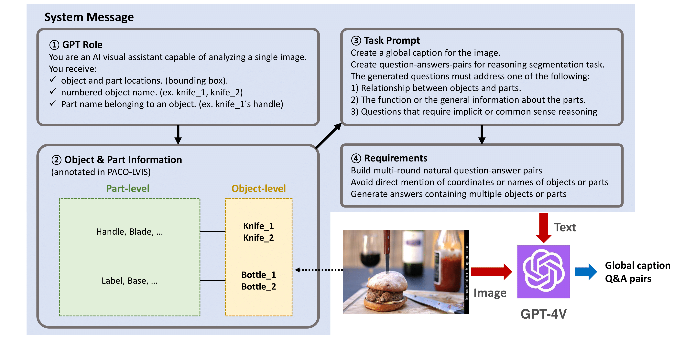
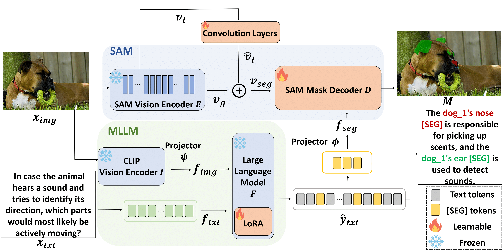

# MMR: A Large-scale Benchmark Dataset for Multi-target and Multi-granularity Reasoning Segmentation (ICLR 2025)

This repository provides the official PyTorch implementation of the following paper:

>**MMR: A Large-scale Benchmark Dataset for Multi-target and Multi-granularity Reasoning Segmentation**

>
>Donggon Jang* (KAIST), Yucheol Cho* (KAIST), Suin Lee (KAIST), Taehyeon Kim (KAIST), and Dae-Shik Kim (KAIST) (*The authors have equally contributed.)
>
>Accepted at ICLR 2025.

>**Abstract:** The fusion of Large Language Models (LLMs) with vision models is pioneering new possibilities in user-interactive vision-language tasks. A notable application is reasoning segmentation, where models generate pixel-level segmentation masks by comprehending implicit meanings in human instructions. However, seamless human-AI interaction demands more than just object-level recognition; it requires understanding both objects and the functions of their detailed parts, particularly in multi-target scenarios. For example, when instructing a robot to "turn on the TV," there could be various ways to accomplish this command. Recognizing multiple objects capable of turning on the TV, such as the TV itself or a remote control (multi-target), provides more flexible options and aids in finding the optimized scenario. Furthermore, understanding specific parts of these objects, like the TV's button or the remote's button (part-level), is important for completing the action. Unfortunately, current reasoning segmentation datasets predominantly focus on a single target object-level reasoning, which limits the detailed recognition of an object's parts in multi-target contexts. To address this gap, we construct a large-scale dataset called Multi-target and Multi-granularity Reasoning (MMR). MMR comprises 194K complex and implicit instructions that consider multi-target, object-level, and part-level aspects, based on pre-existing image-mask sets. This dataset supports diverse and context-aware interactions by hierarchically providing object and part information. Moreover, we propose a straightforward yet effective framework for multi-target, object-level, and part-level reasoning segmentation. Experimental results on MMR show that the proposed method can reason effectively in multi-target and multi-granularity scenarios, while the existing reasoning segmentation model still has room for improvement.

## MMR Dataset
**MMR datsset** is a large-scale benchmark dataset for multi-target and multi-granularity reasoning segmentation. 

### Generation Process
To generate a multi-target, object-level, and part-level reasoning segmentation dataset, we adopt ChatGPT/GPT-4V API which has robust visual understanding capabilitie. To guide the GPT-4V API effectively, we carefully craft prompts that include **GPT role**, **object and part information**, **task prompts**, and **requirements**. The GPT-4V-assisted data generation follows a two-step process: **1) Global Caption Generation:** GPT-4V API first generates a global caption based on the image to foster a deep understanding of its context. **2) Question-Answer Pair Generation:** Leveraging this global caption alongside object and part information, GPT-4V autonomously crafts multi-target and multi-granularity question-answer pairs
<p align="center">  </p>


### Example
<p align="center">  </p>


### Statistics
The MMR dataset includes **194,398 intricate and implicit question-answer pairs** with 57,643 corresponding images and masks selected from PACO-LVIS. The entire dataset is split into distinct sets for training (154,127 pairs), validation (8,194 pairs), and test (32,077 pairs).
<p align="center">  </p>


### Download
The MMR dataset can be downloaded from this [google drive link](https://drive.google.com/drive/folders/1d8FIs4cCmQLMuYAB4s2-_bH0HUI3CjNC?usp=drive_link).

The link for the MMR dataset is structured as follows:
```
MMR/
├── MMR_test_mixed.json
├── MMR_test_obj_only.json
├── MMR_test_part_only.json
├── MMR_train.json
├── MMR_val.json
```

### Json Format 
```
 data:
    {
        `file_name': str, a file name of the image,
        `height': int, height of the image,
        `width': int, width of the image,
        `image_id': int, id of the image,
        `not_exhaustive_category_ids': List[int], list of category ids that don't have all of their instances marked exhaustively,
        `neg_category_ids': List[int], list of category ids that were verified as not present in the image,
        `coco_url': str, image URL,
        `questions': List[str], the complex and implicit questions about the objects and parts within an image,
        
        `annotations':
            {
            `bbox': List[float], bounding box of the object or part,
            `segmentation': 
                {
                `size': List[int], the size of the image,
                `counts': RLE format, segmentation binary mask information,
                }
            `image_id': int, id of the image,
            `category_name': str, category_name of the object or part,
            `category_id': int, category_id,
            `sorted_category_id': int, sorted id in ascending order,
            }
        `answers': List[dicts], the annotations corresponding to the questions,
        `text_answers': List[str], the text answers to the questions,
        `raw_answers': List[str], the raw answers from GPT API to the questions,
    }
```


## M<sup>2</sup>SA Model
### Architecture
<p align="center">  </p>

### Installation 
1. Clone this repository

```
git clone https://github.com/jdg900/MMR.git
cd MMR
```
2. To install requirements using conda environment
```
conda env create -n [env name] -f M2SA.yaml
conda activate [env name]
pip install flash-attn --no-build-isolation
```

### Training
#### Data Preparation
The training datasets are composed in the same way as [LISA](https://github.com/dvlab-research/LISA?tab=readme-ov-file).

The training datasets consist of 4 types of data:
1. Semantic segmentation datasets: [ADE20K](http://data.csail.mit.edu/places/ADEchallenge/ADEChallengeData2016.zip), [COCO-Stuff](http://calvin.inf.ed.ac.uk/wp-content/uploads/data/cocostuffdataset/stuffthingmaps_trainval2017.zip), [Mapillary](https://www.mapillary.com/dataset/vistas), [PACO-LVIS](https://github.com/facebookresearch/paco/tree/main#dataset-setup), [PASCAL-Part](https://github.com/facebookresearch/VLPart/tree/main/datasets#pascal-part), [COCO Images](http://images.cocodataset.org/zips/train2017.zip)

    Note: You should also add COCO train2017 and COCO val 2017 under the refer_seg path.

2. Referring expression segmentation datasets: [RefCOCO](https://web.archive.org/web/20220413011718/https://bvisionweb1.cs.unc.edu/licheng/referit/data/refcoco.zip), [RefCOCO+](https://web.archive.org/web/20220413011656/https://bvisionweb1.cs.unc.edu/licheng/referit/data/refcoco+.zip), [RefCOCOg](https://web.archive.org/web/20220413012904/https://bvisionweb1.cs.unc.edu/licheng/referit/data/refcocog.zip), [RefCLEF](https://web.archive.org/web/20220413011817/https://bvisionweb1.cs.unc.edu/licheng/referit/data/refclef.zip) ([saiapr_tc-12](https://web.archive.org/web/20220515000000/http://bvisionweb1.cs.unc.edu/licheng/referit/data/images/saiapr_tc-12.zip)), [RefCOCOm](https://github.com/Rubics-Xuan/MRES)


3. Visual question answering dataset: [LLaVA-Instruct-150k](https://huggingface.co/datasets/liuhaotian/LLaVA-Instruct-150K/blob/main/llava_instruct_150k.json)


4. Our MMR dataset: [MMR](https://drive.google.com/drive/folders/1d8FIs4cCmQLMuYAB4s2-_bH0HUI3CjNC?usp=drive_link)
    Note: Images and masks in MMR dataset are based on COCO Images.


Download the total datasets from the above links, and organize them as follows.

```
├── dataset
│   ├── ade20k
│   │   ├── annotations
│   │   └── images
│   ├── coco
│   │   └── train2017
│   │       ├── 000000000009.jpg
│   │       └── ...
│   ├── cocostuff
│   │   └── train2017
│   │       ├── 000000000009.png
│   │       └── ...
│   ├── llava_dataset
│   │   └── llava_instruct_150k.json
│   ├── mapillary
│   │   ├── config_v2.0.json
│   │   ├── testing
│   │   ├── training
│   │   └── validation
│   ├── refer_seg
│   │   ├── images
│   │   |   ├── saiapr_tc-12 
│   │   |   └── mscoco
│   │   |       └── images
│   │   |           └── train2014
│   │   ├── refclef
│   │   ├── refcoco
│   │   ├── refcoco+
│   │   └── refcocog
│   │   └── RefCOCOm
│   │        ├── masks
│   │        └── annotations
│   ├── vlpart
│   │    ├── paco
│   │    │   └── annotations
│   │    └── pascal_part
│   │        ├── train.json
│   │        └── VOCdevkit
│   │
│   │   
│   └── MMR
│       ├── MMR_train.json
│       ├── MMR_val.json
│       ├── MMR_test_mixed.json
│       └── MMR_test_obj_only.json
│       └── MMR_test_part_only.json
```


#### Pre-trained LLaVA weights
To train M<sup>2</sup>SA-7B and M<sup>2</sup>SA-13B, loading LLaVA's pre-trained weights are required. For M<sup>2</sup>SA-7B we use LLaVA-Lightning-7B-v1-1 merged from `liuhaotian/LLaVA-Lightning-7B-delta-v1-1`, and for M<sup>2</sup>SA-13B, we use liuhaotian/llava-llama-2-13b-chat-lightning-preview.


#### Pre-trained SAM weights
Download SAM ViT-H pre-trained weights from the [link](https://dl.fbaipublicfiles.com/segment_anything/sam_vit_h_4b8939.pth), and put pre-trained weights in `./vision_pretrained`.

#### Training

```
deepspeed --include=localhost:0,1,2,3 --master_port=24999 train_ds.py \
 --version="PATH_TO_LLaVA" \
 --dataset_dir="./dataset/" \
 --dataset="sem_seg||refer_seg||vqa||multi_part_reason_seg" \
 --vision-tower="openai/clip-vit-large-patch14" \
 --batch_size=2 \
 --num_classes_per_sample=3 \
 --num_classes_per_question=3 \
 --use_expand_question_list \
 --model_max_length 2048 \
 --sample_rates="2,9,2,6" \
 --exp_name="M2SA" \
 --val_dataset="MultiPartReasonSeg|val" \
 --val_json_name="MMR_val.json" \
```
When training is finished, to get the full model weight:

```
cd ./runs/M2SA-7B/ckpt_model && python zero_to_fp32.py . ../pytorch_model.bin
```

#### Merge LoRA Weight
Merge the LoRA weights of `pytorch_model.bin`, save the resulting model into your desired path in the Hugging Face format:

```
CUDA_VISIBLE_DEVICES="" python merge_lora_weights_and_save_hf_model.py \
  --version="PATH_TO_LLaVA" \
  --weight="PATH_TO_pytorch_model.bin" \
  --save_path="PATH_TO_SAVED_MODEL"
```

For example:
```
CUDA_VISIBLE_DEVICES=0 python merge_lora_weights_and_save_hf_model.py \
  --version="./LLaVA/LLaVA-Lightning-7B-v1-1" \
  --weight="./runs/M2SA-7B/pytorch_model.bin" \
  --save_path="M2SA-7B"
```

### Validation
```
deepspeed --include=localhost:0,1,2,3 --master_port=24999  train_ds.py \
 --version="PATH_TO_M2SA_MODEL_Directory" \
 --exp_name="M2SA-7B-val" \
 --dataset_dir='./dataset' \
 --val_dataset="MultiPartReasonSeg|val" \
 --eval_only \
 --val_json_name="MMR_val.json" \
```


## Benchmark Results
- Results on MMR benchmark.

| Methods                        | val (gIoU) | val (cIoU) | Obj (gIoU) | Obj (cIoU) | Part (gIoU) | Part (cIoU) | Obj & Part (gIoU) | Obj & Part (cIoU) |
|--------------------------------|----------|----------|----------|----------|-----------|-----------|-----------------|-----------------|
| LISA-7B    | 13.8     | 18.3     | 23.5     | 25.1     | 6.6       | 7.9       | 14.5            | 17.9            |
| LISA-7B<sub>tr</sub>           | 19.4     | 31.6     | 34.7     | 41.8     | 8.0       | 13.1      | 19.5            | 27.1            |
| **M<sup>2</sup>SA-7B**         | **27.8** | **48.6** | **41.0** | **55.6** | **13.5**  | **27.0**  | **30.9**        | **46.8**        |
| LISA-Llama2-13B  | 15.4     | 20.0     | 26.1     | 27.9     | 7.4       | 8.4       | 16.1            | 19.8            |
| LISA-Llama2-13B<sub>tr</sub>   | 22.3     | 33.4     | 40.2     | 45.2     | 10.7      | 16.4      | 23.0            | 29.2            |
| **M<sup>2</sup>SA-Llama2-13B** | **28.4** | **49.1** | **42.3** | **57.6** | **13.6**  | **27.2**  | **31.6**        | **47.6**        |


- Results on RefCOCOm benchmark. For a fair comparison with previous methods, the mIoU metrics are adopted.

| Methods                                | val-Part | val-Obj & Part | testA-Part | testA-Obj & Part | testB-Part | testB-Obj & Part |
|----------------------------------------|----------|----------------|------------|------------------|------------|------------------|
| SeqTR             | 13.9     | 28.2           | 12.1       | 22.8             | 18.1       | 34.7             |
| CRIS              | 10.6     | 25.4           | 10.1       | 21.2             | 12.9       | 30.0             |
| LAVT                | 15.3     | 29.9           | 13.2       | 24.4             | 18.7       | 35.5             |
| X-Decoder     | 16.2     | 29.5           | 13.6       | 23.6             | 20.3       | 33.8             |
| SEEM          | 16.1     | 29.4           | 13.6       | 23.4             | 20.4       | 33.9             |
| UniRES       | 19.6     | 34.3           | 16.4       | 27.8             | 25.2       | **41.7**         |
| LISA-7B              | 21.3     | 34.3           | 18.5       | 28.6             | 25.7       | 40.1             |
| **M<sup>2</sup>SA-7B**                 | **22.4** | **35.5**       | **19.9**   | **30.1**         | **27.1**   | 41.4             |
| LISA-Llama2-13B     | 22.1     | 35.2           | 19.4       | 29.7             | 27.2       | 41.6             |
| **M<sup>2</sup>SA-Llama2-13B**         | **24.5** | **37.3**       | **21.9**   | **31.9**         | **28.5**   | **42.7**         |


## Acknowledgements
This codebase ie built on [LISA](https://github.com/dvlab-research/LISA?tab=readme-ov-file), [LLaVA](https://github.com/haotian-liu/LLaVA), and [SAM](https://github.com/facebookresearch/segment-anything). We thank the authors for sharing their code. Their valuable work has greatly contributed to the development of our codebase.